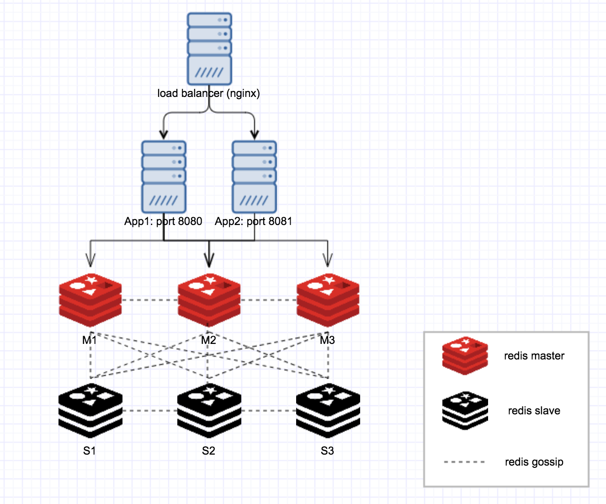
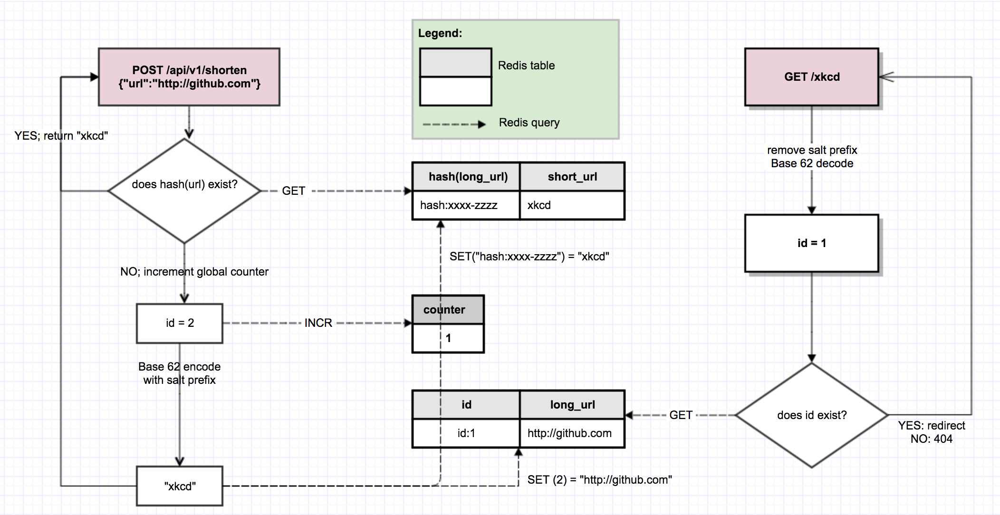
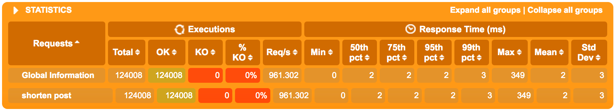
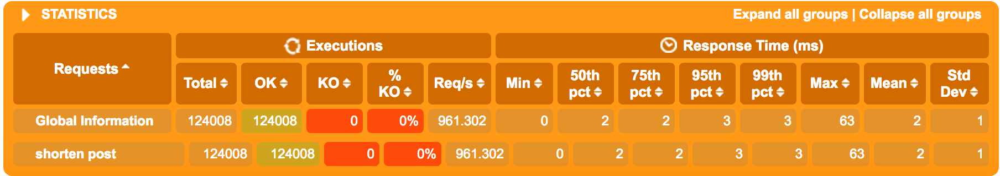

dicely is a URL shortening service. 

### Try it out

An example Dicely service is deployed on a digital ocean instance. 

```
> curl -H "Content-Type: application/json" -X POST -d '{"url":"https://github.com"}' http://46.101.75.1/api/v1/shorten
> {"status_code":200,"status_text":"OK","data":{"short_url":"http://46.101.75.1/mb3","long_url":"https://github.com","hash":"mb3","new_hash":true}}
> curl http://46.101.75.1/mb3
> This and all future requests should be directed to <a href="https://github.com">this URI</a>
```

Note: curl does not render redirect. If you open "http://46.101.75.1/mb3" in browser you will see the redirect.

### Run locally

You will need:

- java 1.8
- a local running redis instance (not required if running tests only). You can quickly get one running following instruction [here](https://redis.io/topics/quickstart)

Then: 

```
> git clone git@github.com:xysun/dicely.git
> cd dicely
> sbt compile
> sbt test // unit tests
> sbt run
```

### Design

Here is the architecture of sample service deployed on that digital ocean instance: 

(Send me your public key if you want to log in to server and play around)



It's easy to scale horizontally for both service layer and database layer. 

Here is the algorithm design: 




### Features

- Can shorten up to 4.3bn urls (roughly same as the [internet size](http://www.worldwidewebsize.com/)). Each short url is <= 7 characters. It's also very easy to extend to bigger size. 
- Same short url returned for multiple requests of same long url. 
- Protection against enumeration of all database entries with random salt prefix. 
- Not tied to redis, easy to swap to a different database. 
- Fast. 
    - Using gatling to hit local instance (local java + local standalone redis, on a normal macbook pro) with 1000 new url POST requests/sec
     
    - You can see gatling report [here](https://github.com/xysun/dicely/tree/master/dicelysimulation/index.html) (GitHub does not render .html files, so better open locally)
    - Note: if you use redis-cluster, you'll get better tail performance. Here's gatling report for a local 6-node cluster:

     
    - See below "Loadtest" section on how to run loadtest.  


### Furthur improvements

- An URL shortening service usually has high read-to-write ratio. We can separate both at application layer and database layer (redis support readonly nodes in a cluster)
- URL shortening service is usually the target for heavy spammers. We can implement some kind of spam filtering to protect the service. 

### Loadtest

Gatling is included in project. 

First you should have a local dicely instance running at port 8080, then:

```
> sbt
> gatling:TestOnly gatling.DicelySimulation
```

It will hit local dicely instance with 1000 POST new url requests per second. 

You can also change host and port in `test/scala/gatling/DicelySimulation` to hit a dicely instance of your choice.

### Deploy as standalone jar

First update settings in `prod.conf`, specifically: 

- `domain`: the domain for returned short url. For example, if you'd like to have `http://dice.ly/xkcd`, then set `domain = "dice.ly"`
- `port`: port of application 
- `get-port`: port to serve incoming GET requests. It may be different from application port above as very often there's a load balancer in front of application servers.
- `redis`: 
	
	- `mode`: support both "standalone" and "cluster"
	- `host`, `port`: host and port for redis. For cluster mode, it's enough to specify one master node, the application will discover other nodes in the cluster automatically.
	
Then:

```
> sbt assembly // jar in target/scala-2.11
> java -Dlogback.configurationFile=logback_prod.xml -Dconfig.resource=prod.conf -jar target/scala-2.11/dicely.jar <port>
```

Logs are saved in `/var/log/dicely`, make sure you have that dir available with write permission. 


